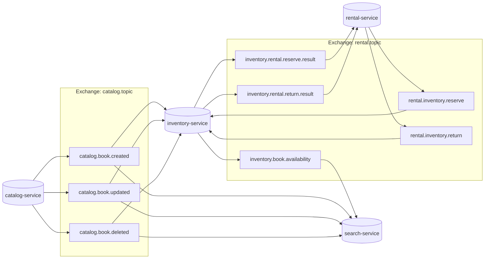
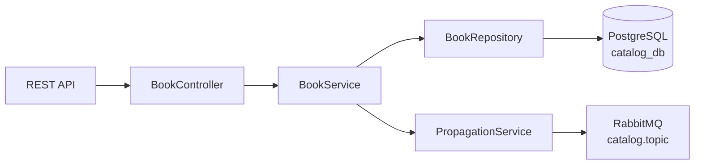
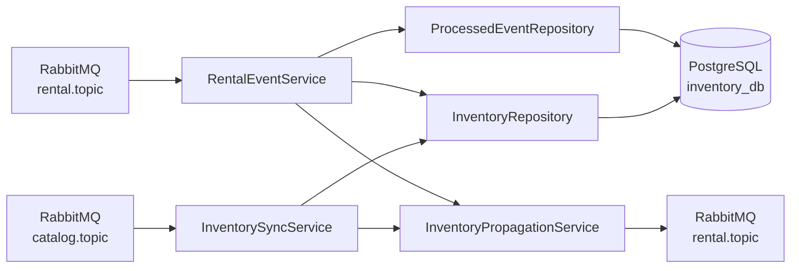
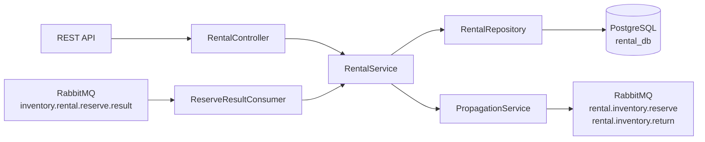
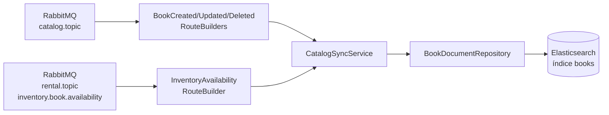
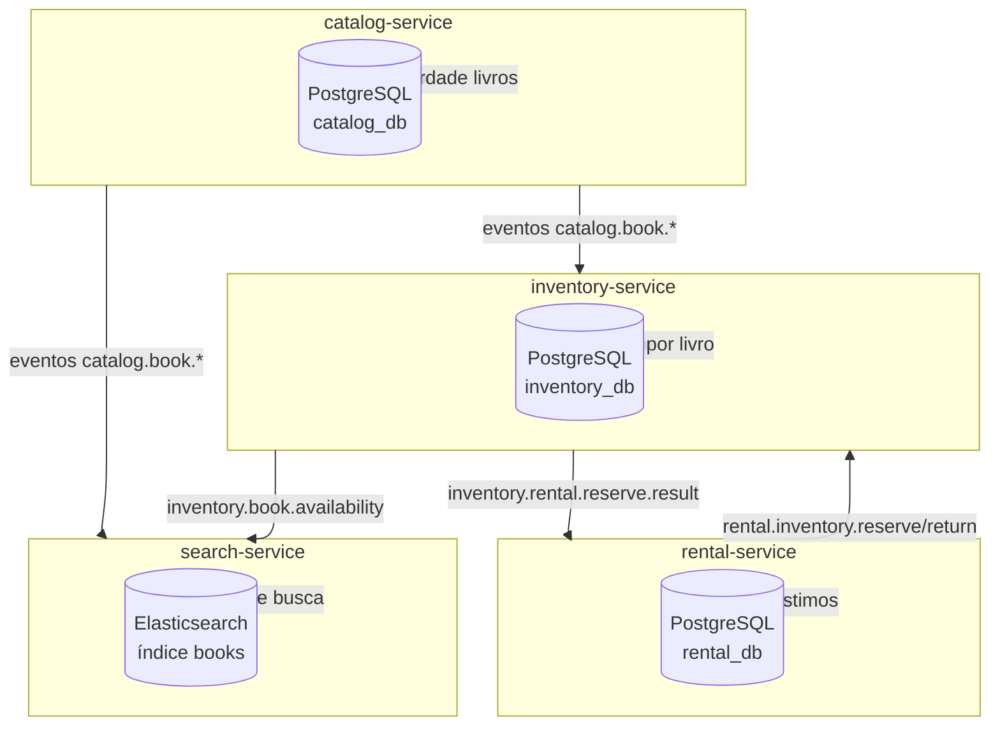

# Fluxogramas: sistema, broker e persistência

Documento com fluxogramas do sistema de biblioteca distribuída: visão por serviço e visão geral. Os diagramas usam **Mermaid** (renderizam no GitHub, GitLab e em editores com suporte).

---

## 1. Visão geral do sistema

```
┌─────────────────────────────────────────────────────────────────────────────────────────┐
│                                    SISTEMA (Biblioteca)                                    │
├─────────────────────────────────────────────────────────────────────────────────────────┤
│                                                                                           │
│   ┌──────────────┐     REST      ┌─────────────────┐     eventos      ┌──────────────┐   │
│   │   Cliente/   │ ────────────► │ catalog-service  │ ───────────────► │   RabbitMQ   │   │
│   │   API       │               │ (CRUD livros)    │  catalog.topic   │ (broker)     │   │
│   └──────────────┘               └────────┬────────┘                  └──────┬───────┘   │
│         │                                    │                                  │          │
│         │ REST                               │ PostgreSQL                       │          │
│         ▼                                    ▼                                  │          │
│   ┌──────────────┐               ┌─────────────────┐                            │          │
│   │ rental-      │◄─────────────│ inventory-      │◄── rental.topic ───────────┤          │
│   │ service      │  reserve/     │ service         │   (reserve/return/           │          │
│   │ (empréstimos)│  return      │ (estoque)       │    availability)            │          │
│   └──────┬───────┘               └────────┬────────┘                            │          │
│          │                                │                                        │          │
│          │ PostgreSQL                     │ PostgreSQL                             │          │
│          ▼                                ▼                                        │          │
│   ┌──────────────┐               ┌─────────────────┐     inventory.book.          │          │
│   │              │               │ search-service  │◄── availability ──────────────┤          │
│   │              │               │ (busca)         │     catalog.book.*           │          │
│   │              │               └────────┬────────┘◄─────────────────────────────┘          │
│   │              │                        │                                                  │
│   │              │                        ▼ Elasticsearch                                    │
│   │              │               ┌─────────────────┐                                        │
│   │              │               │   Elasticsearch │                                        │
│   │              │               │   (índice books)│                                        │
│   │              │               └─────────────────┘                                        │
│   └──────────────┘                                                                          │
└─────────────────────────────────────────────────────────────────────────────────────────┘
```

---

## 2. Broker de mensagens (RabbitMQ) – exchanges, routing keys e filas

### 2.1 Exchange **catalog.topic** (tipo topic)

| Quem publica    | Routing key            | Quem consome        | Fila                  |
|----------------|------------------------|---------------------|------------------------|
| catalog-service| catalog.book.created   | inventory-service   | inventory.book.created |
| catalog-service| catalog.book.updated   | inventory-service   | inventory.book.updated |
| catalog-service| catalog.book.deleted   | inventory-service   | inventory.book.deleted |
| catalog-service| catalog.book.created   | search-service      | search.book.created    |
| catalog-service| catalog.book.updated   | search-service      | search.book.updated    |
| catalog-service| catalog.book.deleted   | search-service      | search.book.deleted    |

### 2.2 Exchange **rental.topic** (tipo topic)

| Quem publica    | Routing key                     | Quem consome        | Fila                          |
|----------------|---------------------------------|---------------------|-------------------------------|
| rental-service | rental.inventory.reserve        | inventory-service   | inventory.rental.reserve      |
| rental-service | rental.inventory.return         | inventory-service   | inventory.rental.return       |
| inventory-svc  | inventory.rental.reserve.result | rental-service      | rental.inventory.reserve.result |
| inventory-svc  | inventory.rental.return.result   | rental-service      | rental.inventory.return.result  |
| inventory-svc  | inventory.book.availability     | search-service      | search.inventory.availability   |

### 2.3 Diagrama do broker (Mermaid)



---

## 3. Banco de dados e motor de busca por serviço

### 3.1 catalog-service

- **Persistência:** PostgreSQL (banco `catalog_db`).
- **Tabela principal:** `tb_livro` (livros: título, autor, categoria, ISBN, etc.).
- **Fluxo:** API REST → BookController → BookService → BookRepository (JPA) → PostgreSQL. Após create/update/delete, publica em `catalog.topic`.



### 3.2 inventory-service

- **Persistência:** PostgreSQL (banco `inventory_db`).
- **Tabelas:** `tb_inventario` (por livro: total, disponíveis, reservadas), `tb_evento_processado` (idempotência de eventos de rental).
- **Fluxo:** Consome catalog.topic (cria/atualiza/inativa inventário) e rental.topic (reserva/devolução). Persiste no PostgreSQL e publica resultado (reserve.result) e disponibilidade (inventory.book.availability) em rental.topic.



### 3.3 rental-service

- **Persistência:** PostgreSQL (banco `rental_db`).
- **Tabelas:** empréstimos/reservas (ex.: `tb_rental` ou equivalente).
- **Fluxo:** API REST para criar empréstimo → publica `rental.inventory.reserve` em rental.topic. Consome `inventory.rental.reserve.result`. Para devolução, publica `rental.inventory.return`.



### 3.4 search-service

- **Persistência:** Elasticsearch (índice `books`).
- **Fluxo:** Consome catalog.topic (create/update/delete do livro) → atualiza documento completo no índice. Consome rental.topic (inventory.book.availability) → atualiza apenas totalCopies, availableCopies e inventoryUpdatedAt no documento.



---

## 4. Visão integrada: banco de dados e motor de busca



---

## 5. Resumo: mesma exchange para inventory → rental e inventory → search?

O inventory-service publica em **rental.topic** dois tipos de evento:

1. **inventory.rental.reserve.result** — consumido apenas pelo **rental-service** (resposta da reserva).
2. **inventory.book.availability** — consumido apenas pelo **search-service** (atualização de total/cópias disponíveis).

**É possível usar a mesma exchange?** Sim. Foi adotada a **rental.topic** para ambos: cada consumidor declara sua fila com o binding na routing key que lhe interessa (rental-service: `inventory.rental.reserve.result`; search-service: `inventory.book.availability`).

**É indicado?** Para este escopo, sim: uma exchange a menos, sem alterar o rental-service, e separação lógica por routing key. Em um sistema maior, pode-se criar uma exchange **inventory.topic** e o inventory publicar todos os seus eventos lá (incluindo reserve.result e availability), com o rental e o search consumindo dessa nova exchange — fica mais alinhado a “um contexto (inventory) uma exchange”, com pequeno refactor no rental.
